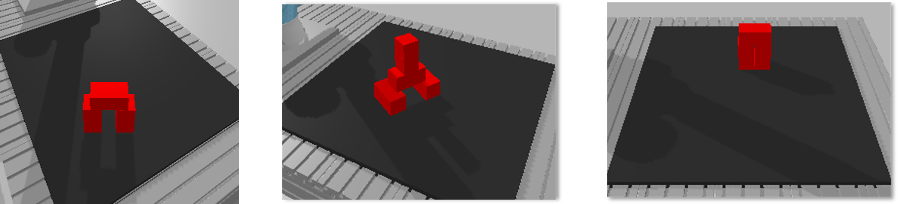

# Robot programming HKA WS 2024
Dieses Repository ist im Zuge der Vorlesung Roboterprogrammierung WS24/25 entstanden. Es beinhaltet die bereitgestellte PyBullet-Umgebung sowie die ebenfalls bereitgestellten Tensorflow-Skripte. Für eine unabhängige Arbeitsumgebung, wurden die beiden bereitgestellten Dockerimages zu einem kombinert, sodass sowohl Tensorflow als auch PyBullet in einem Container verwendet werden können.  
## Aufgabe 
Die Aufgabe besteht darin, eine beliebige Klotzkonfiguration aus mindestens 5 Klötzen mit einem Roboter abzubauen. Dabei dürfen die aufgebauten Klötze nicht umgeworfen werden.
Zu Auswahl stehen hier Reinforcementlearning oder Immitationlearning. Hierbei ist die Entscheidung auf das Immitationlearning gefallen, bei dem ein Transporter Network genutzt wird. Es erzielt mit vergleichsweise wenig Trainingsaufwand gute Ergebnisse. Das Netz lernt aus vorgeführten Greifpositionen, welche in Form von RGB und Tiefendaten aufgenommen werden.

# Bauen und Starten des Containers 
Wie bereits erwähnt, wird ein Dockercontainer verwendet. Dies ermöglicht ein systemunabhängiges Arbeiten. Im folgenden wird der Bau und das Starten des Containers gezeigt. Hierfür wurden die vorhandenen Shell-Skripte erweitert bzw. abgeändert. Dies bietet den Vorteil, den Docker mit verschiedensten Parametersets zu starten und dabei nur einen Befehl nutzen zu müssen. 
## Bau des Containers: 
```bash
./build_image_HVN.sh
```

## Container starten 
```bash
./run_container_HVN.sh
```
Nachdem die Befehle im Terminal eingegeben worden sind, befindet man sich im Workspace des Containers. Dieser ist in je einen Ordner für die PyBullet-Umgebung und die Tensorflow-Anwendungen unterteilt.

## Starten der Simulation 
Um die Simulation starten und Daten aufnehmen zu können muss zunächst in den entsprechenden Ordner navigiert werden: 
```bash
cd scripts_bullet 
```
Hierin befindet sich die generate_tn_data.py, welche sich mit folgendem Befehl starten lässt: 
```bash
python generate_tn_data.py 
```
Nun wird zufällig eine der drei Klotzkonfigurationen an einer zufälligen Position mit einer zufälligen Rotation im Arbeitsraum generiert. Wie oft die einzelnen Konfigurationen abgebaut werden entspricht der in der Config-Datei angegeben Szenen. 

<div align="center">
  
  <p style="font-size:12px; color:gray;"><em>Blockkonfigurationen zur Datengenerierung</em></p>
</div>

## Modell Trainieren 
Um das Modell zu trainieren muss analog zur Simulation in den Tensorflow-Ordner navigiert werden: 
```bash
cd scripts_tf
```
Dort befinden sich diverse Skripte, welche gestartet werden können. Für das Training wird das train_tn.py ausgeführt: 
```bash
python train_tn.py
```
